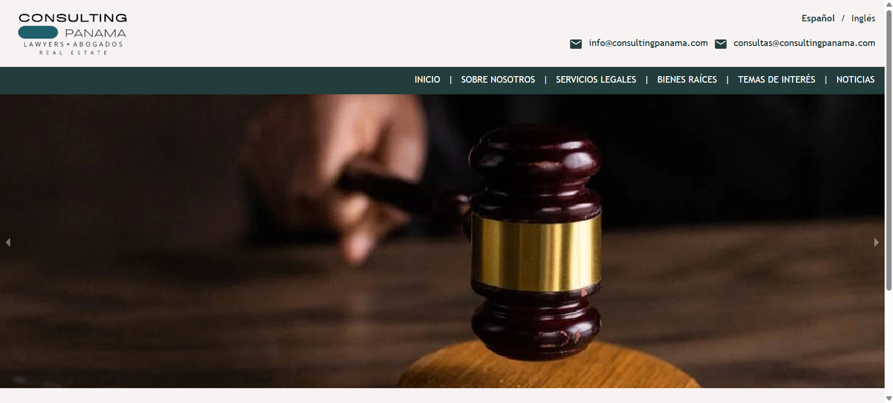
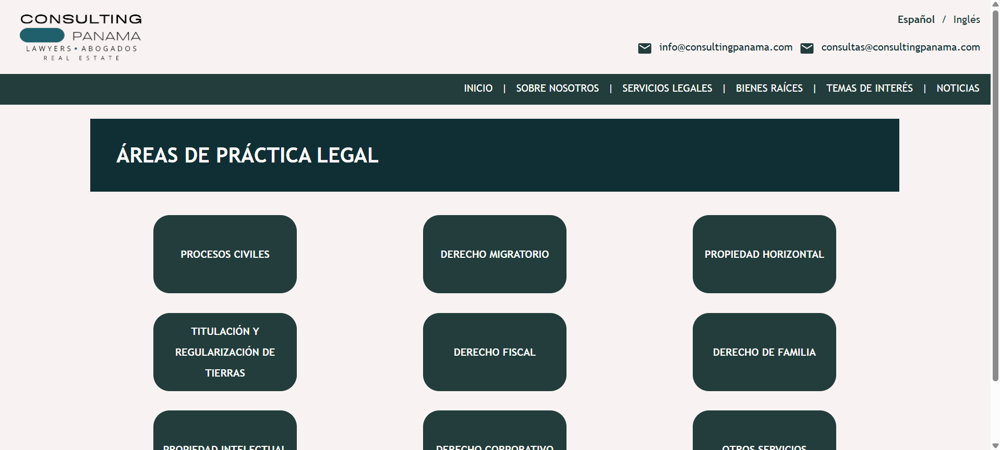
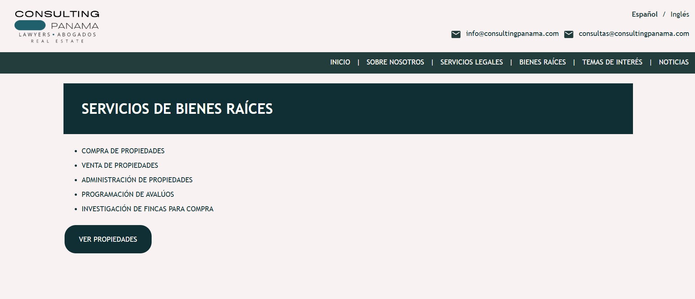
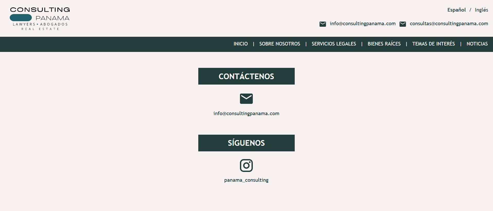

# ConsultingPanama.com  
**Architecture Design for Real Estate & Legal Services Platform**

[🌐 Visit Website](https://consultingpanama.com)

---

## 🧩 Overview  
ConsultingPanama.com is a professional platform that connects clients with **real estate and legal consulting services** in Panama.  

I collaborated on the project as **System Architect**, responsible for designing the **software architecture**, database schema, and API structure to ensure scalability, security, and maintainability.  

---

## 🛠️ My Role  
- Designed the **system architecture** (data flow, API design, and deployment strategy)  
- Defined backend structure and database schema  
- Collaborated with another developer focused on front-end and content integration  
- Ensured **smooth deployment**, **scalability**, and **responsive user experience**

---

## ⚙️ Tech Stack
- **Backend:** PHP  
- **Database:** MySQL  
- **Frontend:** React.js  
- **Hosting / Infrastructure:** Shared Hosting

---

## 📸 Screenshots  

<table>
  <tr>
    <td align="center"><strong>Homepage</strong></td>
    <td align="center"><strong>Lawyers</strong></td>
	<td align="center"><strong>Real Estate</strong></td>
    <td align="center"><strong>Contact</strong></td>
  </tr>
  <tr>
    <td></td>
    <td></td>
	<td></td>
    <td></td>
  </tr>
</table>

---

## 🧠 Key Contribution  
> Architected and implemented the foundational structure for a professional website serving real estate and legal consulting clients, ensuring scalability and seamless user experience.  

---

## 🔗 Live Demo  
👉 [https://consultingpanama.com](https://consultingpanama.com)

---

## 🧾 License  
© 2025 M. All rights reserved.  
This repository is for **showcase purposes only** — no source code is publicly available.
